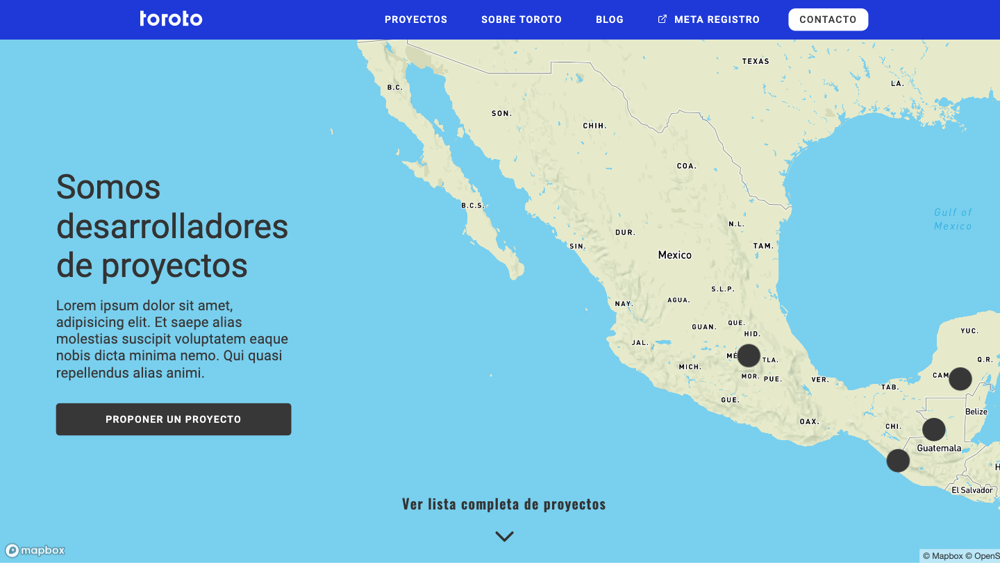

<h1 align="center">Toroto - Proyectos</h1>

Sección de Proyectos y Detalle de Proyecto para el sitio web de Toroto México

## Links

- [Repo](https://github.com/MercedesMulet/toroto-proyectos<project-name> '<project-name> Repo')

- [API](https://fieldops-api.toroto.mx/api/projects 'API')

## Screenshot

## Construído con

- ReactJS
- NPM
- Webpack
- HTML
- SASS
- MapBox

## Futuras actualizaciones

- [ ] Corregir popup en Mapa
- [ ] Hacer navegable el mapa de la sección de Detalle de Proyecto
- [ ] Agregar modal
- [ ] Agregar carrusel de imágenes

## Autor

**Mercedes Mulet**

- [Profile](https://github.com/MercedesMulet 'Mercedes Mulet')
- [Email](mailto:mercedes.mulet@gmail.com?subject=Hola 'Hola!')
- [Website](https://mercedesmulet.com 'Mi sitio')
- [LinkedIn](https://www.linkedin.com/in/mercedes-mulet/ 'Mi LinkedIn')

## 🤝 Support

Contribuciones, problemas, y solicitud de features son bienvenidos!

Dame una ⭐️ si te gustó el proyecto!
